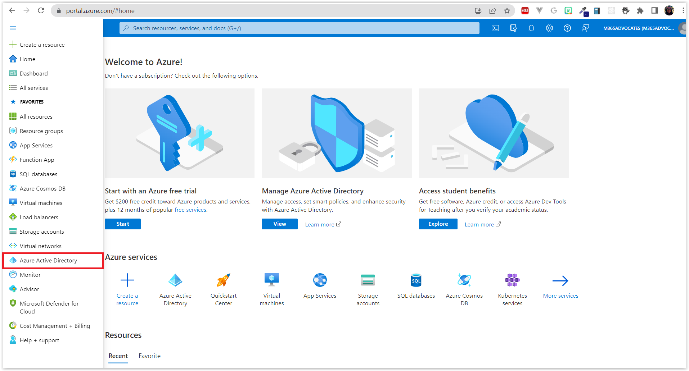
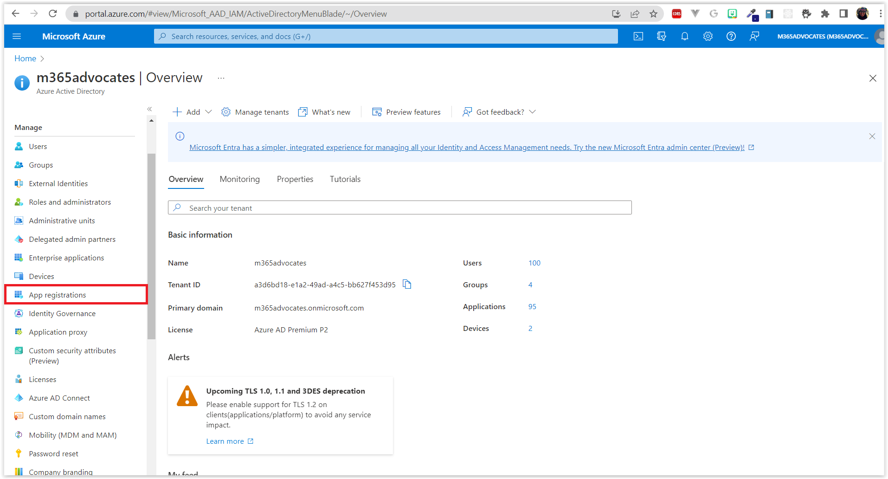
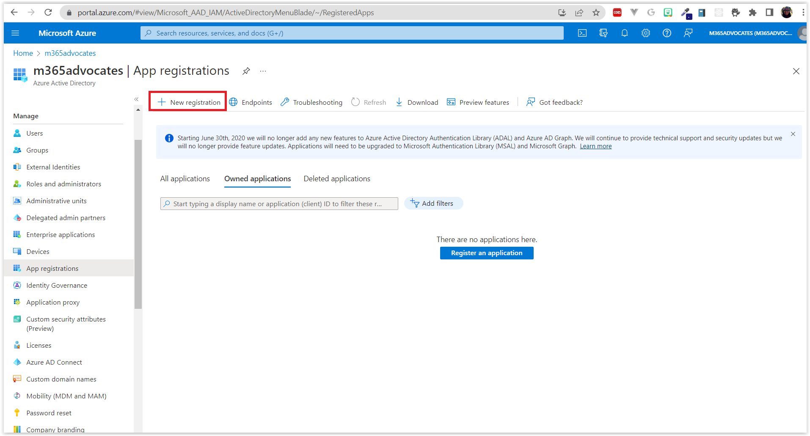
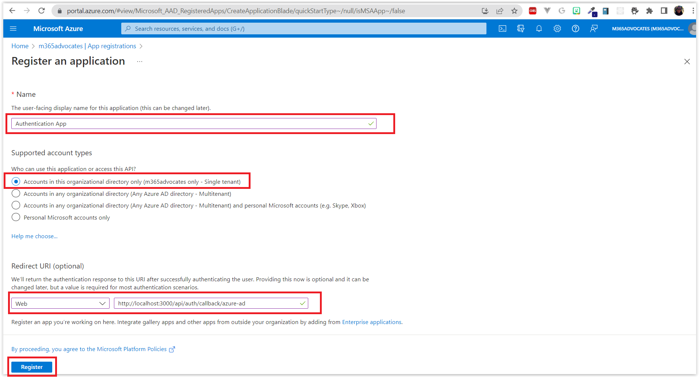
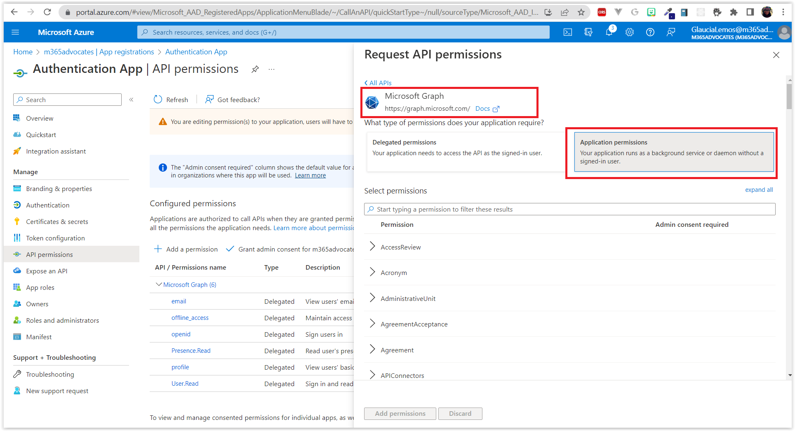
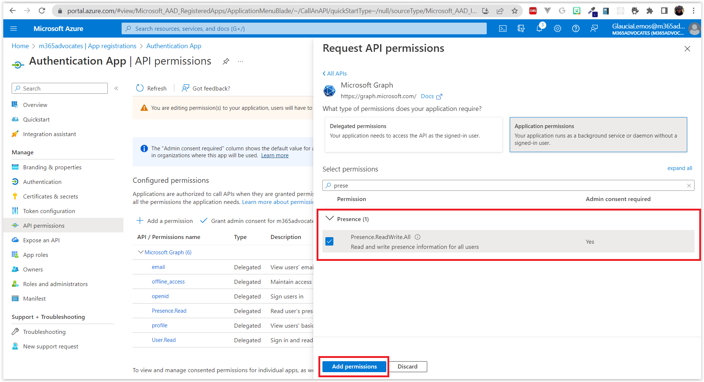
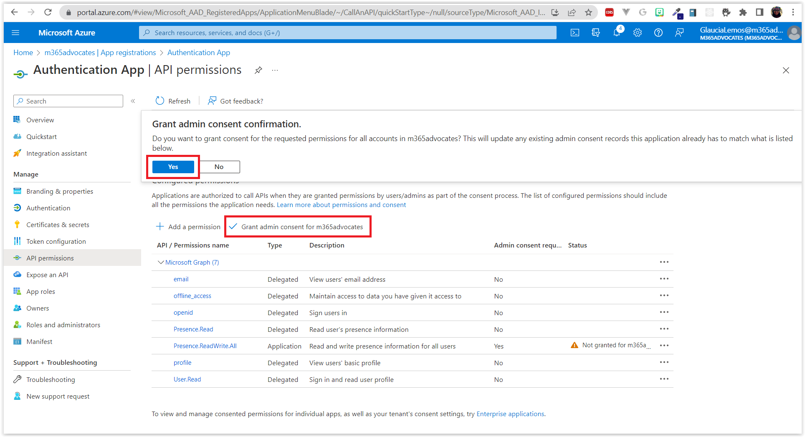

# Create an Application in Azure Active Directory

In this session, you will learn how to create an application in Azure Active Directory (AAD) and configure the necessary permissions so that the application can access the user's data.

Before starting to develop the application, you need to create an application in the Azure Active Directory (AAD). For this, go now to the **[Azure Portal](https://portal.azure.com/)**, use your M365 Developer Program account and click on **Azure Active Directory**.

Now, let's go to the step by step!

## Step by Step

1. Go to **[Azure Portal](https://portal.azure.com/)** and click on **Azure Active Directory**.

2. Click on **App Registrations**.

3. Click on **New Registration**.

4. Fill in the fields as shown below and click on **Register**.

5. Go to **Overview** and copy:
   
- **Application (client) ID**
- **Directory (tenant) ID**

> We will use these values to configure the application in the `env.local` file.

## Configure the Application

6. Go to **Certificates & secrets** and click on **New client secret**.

7. Fill the field **Description** and click on **Add**.

8. Copy the **Value** of the **Client secret**.

> **Obs.:** don't forget to save this value, you will need it later. If you lose it, you will need to create a new one.

9. Go to **API permissions** and click on **Add a permission**.

10. Click on **Microsoft Graph** amd then on **Delegated permissions**.

11. Select the following permissions and click on **Add permissions**.

- **email**
- **offline_access**
- **openid**
- **Presence.Read**
- **profile**

12. Go to **Microsoft Graph** again and click on **Application permissions**.

13. Select the following permissions and click on **Add permissions**.

- **Presence.ReadWrite.All**

14. Click on **Grant admin consent for <your-tenant-name>** and click on **Yes**.

Congratulations! YEAH! 🎉🎉🎉

You have successfully created an application in Azure Active Directory and configured the necessary permissions so that the application can access the user's data.

Now, let's go to the next session!

**[⬅️ Back: Intro](./01-intro.md)**
| **[➡️ Next: Session 03](./03-session.md)**