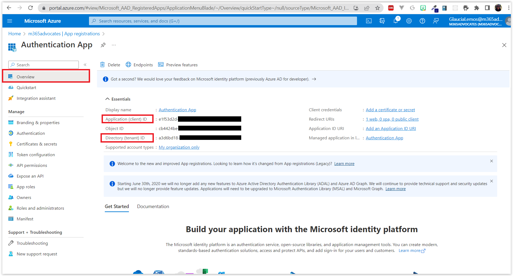
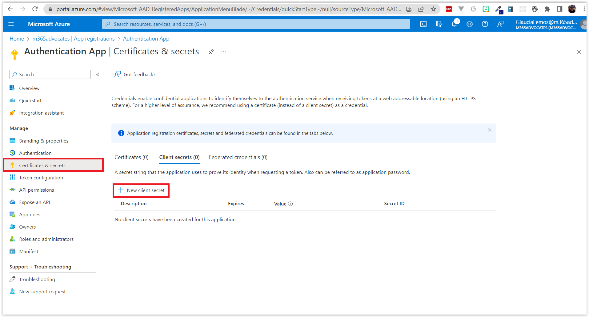
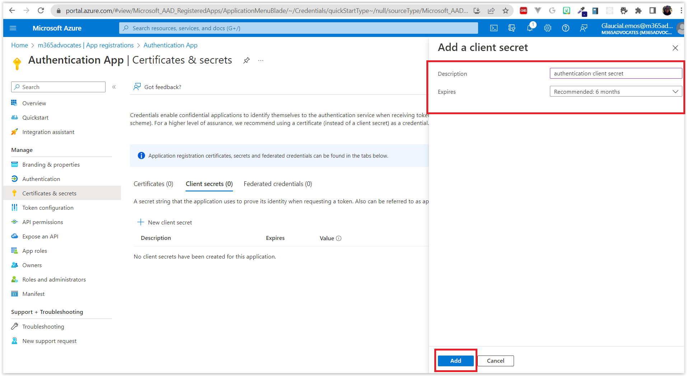
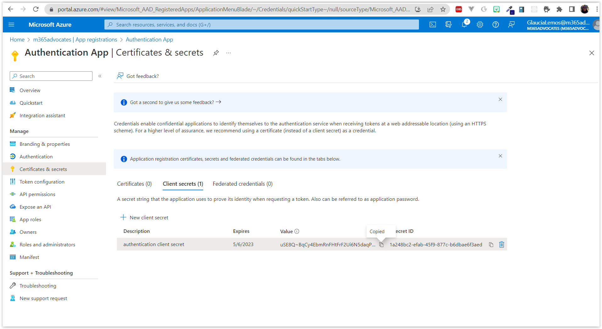
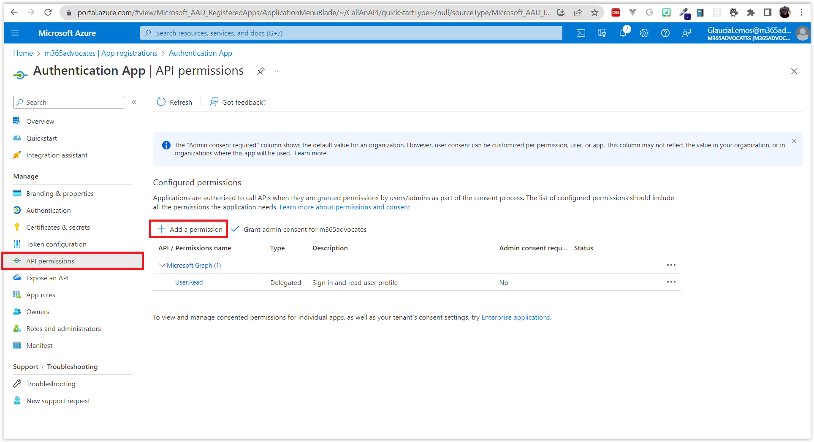
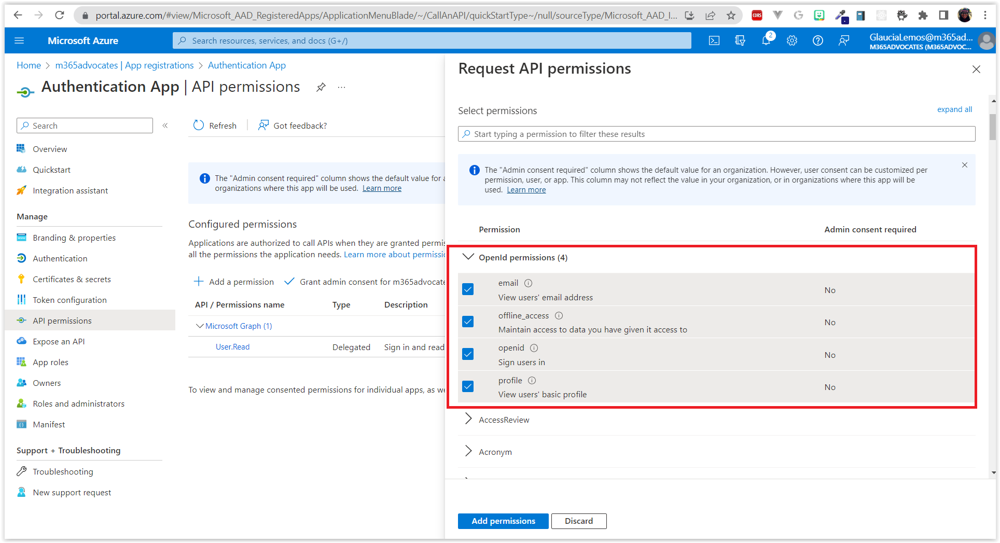
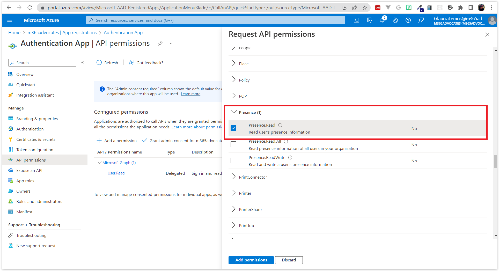

# Criando uma Aplicação no Azure Active Directory

Antes de começar a desenvolver a aplicação, precisamos criar uma aplicação no Azure AD. Para isso, vamos acessar o portal do Azure e clicar em **Azure Active Directory**.

Esperamos que nesse momento você já tenha criado uma conta no Microsoft 365 Developer Program. Caso não tenha, você pode assistir esse vídeo **[AQUI](https://www.youtube.com/watch?v=JvWLgirC8xs)**. Pois explica direitinho como criar a conta.

Vamos ao passo ao passo!

## Passo a Passo

1. Acessar o **[Portal do Azure](https://portal.azure.com/)** e clicar em **Azure Active Directory**.

2. Clicar em **App registrations**.

3. Clicar em **New registration**.

4. Preencher os campos conforme a imagem abaixo:

5. Clicar em **Register**.

6. Vá em **Overview** e copie o:
   
- **Application (client) ID**
- **Directory (tenant) ID**

Precisaremos desses dados para configurar a aplicação no `env.local`.

## Configurando a Aplicação

7. Vá em **Certificates & secrets** e clique em **New client secret**.

8. Preencha o campo **Description** e clique em **Add**.

9. Copie o **Value** do **Client secret**.

> **Observação**: Não perca esse valor, pois não será possível recuperá-lo posteriormente. Se você perder, você precisará criar um novo.

10. Vá em **API permissions** e clique em **Add a permission**.

11. Selecione **Microsoft Graph** e clique em **Delegated permissions**.

12.  Selecione as seguintes permissões:

- **email**
- **offline_access**
- **openid**
- **Presence.Read**
- **profile**

13. Clique em **Add permissions**.

14. Selecione novamente **Microsoft Graph** e clique em **Application permissions**.

16. Selecione as seguintes permissões:

- **Presence.ReadWrite.All**

17. Clique em **Add permissions**.

18. Clique em **Grant admin consent for ...** e selecione **Yes**.

Parabéns! YEAH! 🎉🎉🎉

Você criou uma aplicação no Azure AD e configurou as permissões necessárias para a aplicação.

Agora, vamos para o próximo passo.

**[⬅️ Voltar: Intro](./01-intro.md)**
| **[➡️ Próximo: Sessão 03](./03-session.md)**